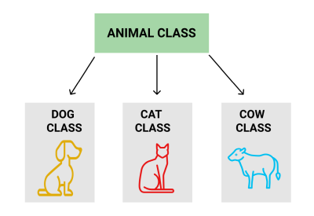

# 2.8 - Inheritance

###### ICS4U - Mr. Brash 🐿

But humans have legs and whales don't... But we both breathe air with lungs. We _inherit_ the trait "lungs" from the mammal _classification_.<br>
The same can be done with objects (classes) in OOP.

# Lesson

- [Jump to the task](TASK.md)

Protection is very important. It is a cornerstone of OOP. But what if we end up with multiple Classes that contain similar code?

---

When _designing_ an object, you might realize that it requires some or all of the same code as another object you already declared. An important idiom of programming is **DRY** - **D**on't **R**epeat **Y**ourself. If you can reuse part of another object, you might want to do so.

Let's use real life **animals** as an example:



All of the animals listed above have ears. They eat. They make noise. They are warm-blooded. But they are different - they make _different_ noises, they eat different foods. They may or may not have fur. What if we included a bird or human?

When declaring classes for these "objects", we might use the following:


Notice the arrows from each `subclass` to the `Animal` `superclass`? This means "Dog comes from Animal", etc. All three subclasses have the traits of `Animal`.

In this example, the `Dog` class _extends_ the `Animal` class but adds a few things. Similarly, the `Cat` and `Cow` classes also _extend_ the `Animal` class. They _inherit_ the values and methods from the `Animal` class and have the opportunity to add their own.

**Here's how that might look in JavaScript:**
```JS
class Animal {
  legs = 2;
  has_fur;
  food = "";

  constructor(legs, fur, food) {
    this.legs = legs;
    this.has_fur = fur;
    this.food = food;
  }

  eat() {
    // Nom nom
  }

  speak() {
    console.log("I'm an Animal");
  }
}

class Dog extends Animal {
  has_fleas = false;

  constructor(food, fleas) {
    this.legs = 4;      // We still have a "legs" attribute
    this.has_fur = true;
    this.food = food;
    this.has_fleas = fleas;
  }

  speak() {
    console.log("WOOF!");
  }  
}
```

For now everything is public - it's easier for demonstrations.

### Notice the keyword `extends` on the `Dog` class!
This means the `Dog` class will _inherit_ everything already created inside the `Animal` class. We can choose to keep it all or overwrite some of it - like overwriting the `speak()` method.

Let's test instances of a generic `Animal` or a `Dog`:
```JS
let a = new Animal(6, false, "Bones");
let d = new Dog("Kibble", false);

a.speak();   // "I'm an Animal"
d.speak();   // "WOOF!"
a.legs       // 6
d.legs       // 4
a.has_fleas  // undefined
d.has_fleas  // false
```

Feel free to copy the above example code into a Repl and play around with it. We won't be using the animal classes, they are just an example.

Hypothetically - would you be able to write the classes for `Cat` and `Cow`?

### Question:
Can you think of some `subclasses` that would inherit from and _extend_ the `Vehicle` class you created?

<br><br><br><br><br><br><br><br>
