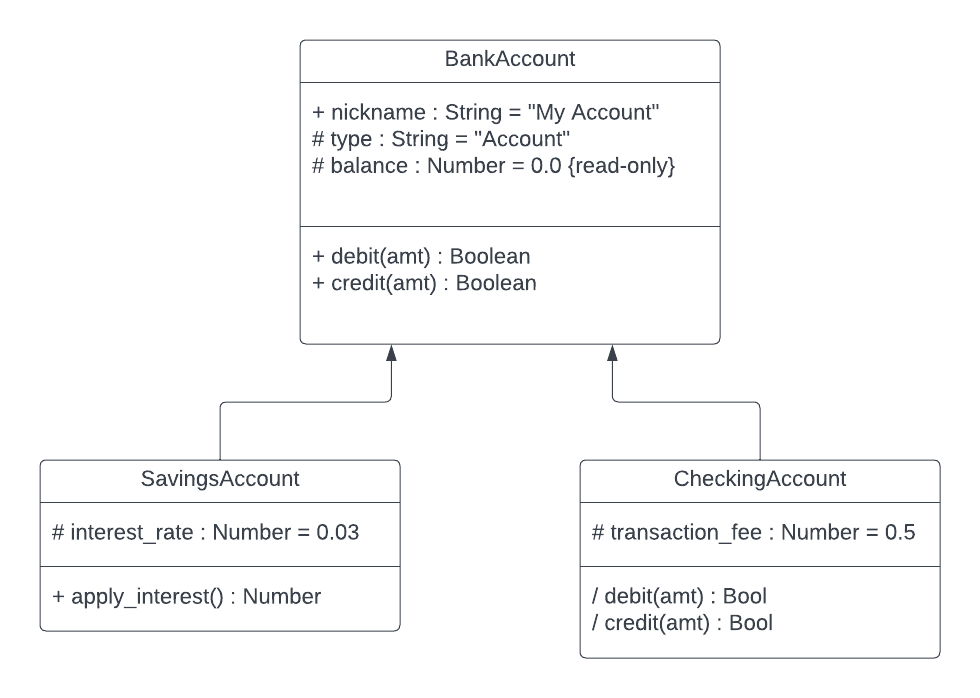

# Your Task (2.8 - Inheritance)

###### ICS4U - Mr. Brash 🐿️

  - [Jump back to the lesson](README.md)

You will get a chance to practice _protection_, _inheritance_, and _super_ in this task.

### Let's roll with the bank account example...

#### A basic `BankAccount` is pretty simple
  - we can give it a `nickname`, which should be read/write (account holders can rename their accounts).
  - It needs a `type`, which will be set by the subclass during instantiation. This property _cannot change_ (you can't modify the _type_ of an account).
  - All accounts have a _protected_ `balance`. The account can start with a certain (positive) balance at creation.
  - All of the above are set during instantiation  `constructor(type, nickname, balance)`
  - Bank accounts have two basic public methods:
    - `debit(amt)` which _removes_ money from the account (if the `amt` is a positive number and there's enough in the `balance`) and _returns_ whether the transaction was successful.
    - `credit(amt)` which _adds_ to the account (if the `amt` is positive) and _returns_ whether it was successful.
    - **Note:** The balance should _always_ be to the nearest _penny_ (two decimals) after every transaction.

#### There are two subclasses (children)
- `SavingsAccount`
  - The nickname defaults to "Basic Savings"
  - The type is "Savings Account"
  - It has a _protected_ member called `interest_rate` which defaults to 0.03.
    - The `interest_rate` has both a `get` and a `set`
      - The `set` will make sure the new interest rate being set is above 0 and below 1
  - It has a _public_ method `apply_interest()` which will utilize the `balance` to calculate an interest amount which is added (debited) to the account.

- `CheckingAccount`
  - The nickname defaults to "Classic Checking"
  - The type is "Checking Account"
  - It has a _protected_ `transaction_fee` (in dollars) that defaults to $0.50. 
    - This fee is applied to _every_ transanction on the account.
    - The `transaction_fee` has both a `get` and a `set`
      - The `set` ensures the fee is never below $0.01 or above $2.00
  - It has two _public_ methods `debit()` and `credit()` which utilize the superclass's methods _and_ adds a transaction fee (removed from the balance of the account). Remember - the transaction is only successful if there is enough money in the account for the debit _and_ the transaction fee.

### Test your code _thoroughly_!  
  - Can you modify the balance of a `SavingsAccount` on your own?
  - Can you modify the `nickname` to "My Life's Savings" after it has been used for a while?
  - Can the balance go below $0.00 ?
  - Does the balance _always_ round to the nearest penny after every transanction (especially applying an interest rate)?
  - Can you have (and control) multiple accounts of each type?

### Was that too easy?
  - Add a protected `transactions` array to the `BankAccount` class that inserts "Balance: $#.##" after each transaction.
    - The `SavingsAccount` and `CheckingAccount` also record their transactions to this record as well. 
    - The record can be displayed whenever needed.
  - Add a `transfer(amount, destination)` method to the `BankAccount` class which _debits_ the current account and sends the money to the `destination` account (which is a `BankAccount` subclass of some sort). 
    - The destination account is _credited_ the amount while the current account is _debited_. 
    - **Note:** the `CheckingAccount` will need to override this method to add the transaction fee.
    - Accounts of type `SavingsAccount` do not incur a fee, no need to override the method.

  🐿️